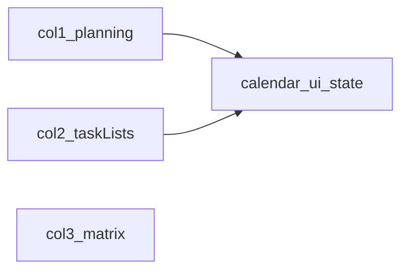

# 3열 그리드 레이아웃 (피드백+캘린더 | 목록 | 매트릭스)

## 목표 구조

- **열 1**: `task-list__feedback` + 월 캘린더(슬라이드/토글 없이 항상 표시). 기존 `[task-list__week-wrap](src/components/TaskList.vue)` 전체(주 이동, today, 전체보기, 7일 스트립) **삭제**.
- **열 2**: 업무 목록 헤더·추가 폼·미완료/완료 섹션만.
- **열 3**: 기존 `[app__content](src/views/HomeView.vue)`의 `PriorityMatrix`.

## 상태 공유 (필수)

`[TaskList.vue](src/components/TaskList.vue)`는 `selectedCalendarDay`, `weekAnchor`, `calendarView`, `applyCalendarForTask`(매트릭스 선택 동기화), `taskMatchesDayFilter`에 같은 값이 필요합니다. 한 컴포넌트에만 두면 3열 분리가 불가능하므로 다음 중 하나를 적용합니다.

**권장**: `[src/stores/calendar-ui-store.ts](src/stores/calendar-ui-store.ts)` (Pinia) 신규

- `selectedCalendarDay: string | null`, `weekAnchor: Date`, `calendarView: { year, month }`
- 액션: `setSelectedDay(dateKey)`, `shiftMonth(delta)`, `goToToday()`, `applyForTask(task)`(기존 `applyCalendarForTask` 로직 이전)
- `weekCells` / `weekRangeLabel`는 `getWeekDaysMonSun(weekAnchor)` 기반 **computed**로 스토어 또는 유틸에서 제공 (피드백 주간 문구용)

**대안**: `provide/inject`를 `[HomeView.vue](src/views/HomeView.vue)`에서만 쓰는 방식은 테스트·깊이에 취약하므로 스토어가 유지보수에 유리합니다.

## [HomeView.vue](src/views/HomeView.vue)

- `app__main`을 `display: grid`로 변경 (예: `grid-template-columns: minmax(260px, 0.9fr) minmax(300px, 1fr) minmax(0, 1.2fr)` — 실제 비율은 디자인에 맞게 조정).
- 자식 순서: **Planning 패널 컴포넌트** → **TaskList** → **PriorityMatrix**.
- 기존 단일 `app__sidebar` 래퍼 제거; 각 열에 `min-height: 0`, `overflow: auto`로 스크롤 영역 분리.
- `[@include mobile](src/views/HomeView.vue)`: `grid-template-columns: 1fr`, `grid-auto-rows: minmax(0, auto)` 등으로 세로 스택(순서: 피드백+캘린더 → 목록 → 매트릭스 유지 권장).

## 새 컴포넌트: `TaskPlanningPanel.vue` (이름은 프로젝트 컨벤션에 맞게)

- `[TaskList.vue](src/components/TaskList.vue)`에서 **이동**: `task-list__feedback` 블록 전체 + 월 캘린더(툴바·그리드) 전체.
- **제거**: `Transition`, `v-if="showMonthCalendar"`, `showMonthCalendar` / `toggleMonthCalendar` / `closeMonthCalendar`, 월 패널 **닫기** 버튼.
- **유지/추가**: 이전/다음 달, 제목, 그리드 셀 클릭 시 스토어의 `setSelectedDay` + `weekAnchor` 갱신(기존 `selectDayFromMonth`와 동일).
- **대체 UX**: 제거된 `today` 버튼은 **월 툴바**에 `today` 또는 “이번 달/오늘”로 배치해 `goToToday()` 호출.

## [TaskList.vue](src/components/TaskList.vue) 정리

- 템플릿 상단에서 `week-wrap`, `feedback`, `month-slide-wrap` **삭제**.
- 로컬 `ref`로 두던 캘린더 관련 상태는 **스토어**로 이전 후 `storeToRefs` 또는 스토어 직접 사용.
- `watch(selectedTaskId)`의 `applyCalendarForTask` → 스토어 액션 호출로 변경.
- `taskMatchesDayFilter`, `displayIncompleteTasks` / `displayCompletedTasks`는 스토어의 `selectedCalendarDay`를 참조.
- 제거 가능한 함수/스타일: `shiftWeek`, `toggleCalendarDay`, `weekDayAriaLabel`(주 스트립용), 주간 dot 전용으로만 쓰이던 일부는 **월 그리드·점**은 Planning으로 이전되므로 `getDotCountForDateKey` 등은 Planning 쪽으로 옮기거나 스토어 + 공용 함수로 유지.

## 스타일

- `[HomeView.vue](src/views/HomeView.vue)`에 3열 그리드 및 열별 클래스.
- `[TaskPlanningPanel.vue](src/components/TaskPlanningPanel.vue)`: 피드백 + 캘린더 세로 스택, 캘린더 `max-height`·내부 스크롤(필요 시).
- `[TaskList.vue](src/components/TaskList.vue)`: 삭제된 주간/슬라이드/피드백 관련 SCSS 블록 정리.

## 테스트·회귀

- `[TaskList.test.ts](src/tests/components/TaskList.test.ts)`: Pinia에 `calendar-ui-store` 등록 후 기본 `selectedCalendarDay` 설정, 또는 스토어 모킹.
- `[App.test.ts](src/tests/components/App.test.ts)`: 홈에 3열 구조·컴포넌트 존재 여부 assertion 업데이트(필요 시).

## 작업 순서 요약

1. `calendar-ui-store` 추가 + 기존 TaskList의 캘린더/선택일/주 로직 이전.
2. `TaskPlanningPanel.vue` 생성 및 TaskList에서 해당 마크업/스크립트/스타일 분리.
3. `TaskList.vue`를 목록 전용으로 슬림화하고 스토어 연동.
4. `HomeView.vue` 3열 그리드 + 컴포넌트 배치.
5. 테스트 및 `npm run build`로 타입/빌드 확인.
