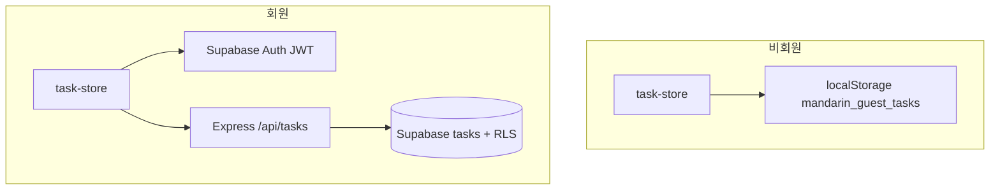

# 로그인·회원가입·프로필 + 회원별 Task / 게스트 로컬 전용

## 아키텍처 요약




- **회원**: 프론트에서 `Authorization: Bearer <access_token>`으로 Express 호출. Express는 요청마다 **동일 anon 키**로 Supabase 클라이언트를 만들되, 헤더에 사용자 JWT를 넘겨 PostgREST가 `auth.uid()`를 인식하게 함 → RLS로 본인 `tasks`만 접근.
- **비회원**: `task-store`가 `apiService`의 tasks API를 **전혀 호출하지 않고** `[src/services/localTaskStorage.ts](src/services/localTaskStorage.ts)` (신규)로 `Task[]`를 직렬화 저장/로드. `fetch-url-title` 등 공용 API는 기존처럼 무인증 호출 가능.

---

## 1. 데이터베이스 (Supabase SQL)

`[server/supabase-schema.sql](server/supabase-schema.sql)`에 반영할 내용 (기존 DB는 SQL Editor로 마이그레이션):

- `tasks`에 `user_id UUID NOT NULL DEFAULT auth.uid() REFERENCES auth.users(id) ON DELETE CASCADE`
  - 기존 행이 있으면: 임시로 `user_id` nullable 추가 후 데이터 정리, 이후 `NOT NULL` + `DEFAULT auth.uid()` 적용 등 단계적 마이그레이션 문서화.
- 인덱스: `CREATE INDEX ON tasks(user_id)`.
- **RLS**: 기존 `"Allow all operations"` 정책 **제거** 후, `SELECT/INSERT/UPDATE/DELETE` 모두 `user_id = auth.uid()` (또는 `auth.uid() = user_id`) 조건.
- `INSERT` 시 `user_id`는 DB 기본값 `auth.uid()`에 맡기거나 앱에서 생략.

---

## 2. 백엔드 Express (`[server/server.js](server/server.js)`)

- **태스크 관련 라우트** (`GET/POST/PUT/PATCH/DELETE /api/tasks...`):
  - `Authorization: Bearer` 없으면 **401** (또는 게스트 전용 분기 없음 — 게스트는 프론트에서 아예 호출 안 함).
  - 토큰이 있으면:

```js
createClient(SUPABASE_URL, SUPABASE_ANON_KEY, {
  global: { headers: { Authorization: req.headers.authorization } },
});
```

```
로 `from('tasks')` 조회/삽입/수정/삭제. **서버 전역 `supabase` 단일 클라이언트로 tasks를 처리하지 말 것** (RLS가 적용되지 않음).
```

- `fetch-url-title` 등 인증 불필요한 라우트는 기존 클라이언트 유지.

---

## 2.1 Supabase JS `auth` API 명세 (`server/server.js`)

`createClient(url, anonKey)`로 만든 인스턴스의 `**auth` 속성**은 GoTrue(Auth) REST API를 감싼 클라이언트다. 아래는 **현재 레포의 Express에서 실제 호출하는 것과, 서버에서 쓸 때의 패턴이다.

### `createClient` 옵션 (서버 쪽)

- `**auth: { persistSession: false, autoRefreshToken: false }`**  
Node에는 브라우저 저장소가 없고, 세션은 **HttpOnly 쿠키로 직접 관리하므로 JS SDK가 세션을 디스크에 유지·자동 갱신하지 않게 둔다.

### 요청별 사용자 JWT가 붙은 클라이언트 (`createUserClient`)

```js
createClient(SUPABASE_URL, SUPABASE_ANON_KEY, {
  global: { headers: { Authorization: `Bearer ${accessToken}` } },
  auth: { persistSession: false, autoRefreshToken: false },
});
```

- 이후 `from('tasks')` 등은 PostgREST가 JWT에서 `auth.uid()`를 인식 → RLS 적용.

### `server.js`에서 사용하는 `auth` 메서드


| 메서드                                                     | 호출 주체                      | 용도                                                                                               |
| ------------------------------------------------------- | -------------------------- | ------------------------------------------------------------------------------------------------ |
| `client.auth.getUser(jwt)`                              | `accessToken`이 붙은 `client` | 액세스 토큰(JWT) 문자열 검증 및 사용자 객체 조회. 쿠키에서 꺼낸 토큰으로 “누구 요청인지” 판별.                                       |
| `supabase.auth.refreshSession({ refresh_token })`       | anon 기본 `supabase`         | 액세스 만료 시 리프레시 토큰으로 새 세션 발급. 성공 시 `setAuthCookies`로 쿠키 재설정.                                       |
| `supabase.auth.signInWithPassword({ email, password })` | anon 기본 `supabase`         | 이메일/비밀번호 로그인. `data.session`에 `access_token`, `refresh_token`, `user` 등.                         |
| `supabase.auth.signUp({ email, password, options })`    | anon 기본 `supabase`         | 회원가입. `options.data`에 `user_metadata`(예: `display_name`). 이메일 확인 설정에 따라 `data.session`이 없을 수 있음. |
| `client.auth.signOut()`                                 | JWT 붙은 `client`            | 해당 액세스 토큰 기준 서버 측 세션 종료 시도. 로그아웃 라우트에서 쿠키 삭제와 함께 호출.                                             |
| `client.auth.updateUser({ data })`                      | JWT 붙은 `resolved.client`   | 로그인 사용자 메타데이터 갱신(프로필). 예: `{ data: { display_name: '…' } }`.                                     |


### 참고 (이 레포에서 쓰지 않지만 같은 `auth`에 있는 것들)

- `getSession()`, `onAuthStateChange()` — 브라우저 클라이언트·세션 유지 모델에 주로 사용.
- `signInWithOAuth`, `signInWithOtp`, `verifyOtp`, `resetPasswordForEmail` 등 — 공급자/OTP/비밀번호 재설정.
- **서비스 롤** 클라이언트 전용 `**auth.admin.` — 일반 anon 클라이언트에는 없음.

전체 시그니처·옵션은 Supabase 공식 [JavaScript Auth 레퍼런스](https://supabase.com/docs/reference/javascript/auth-signinwithpassword)를 따른다.

---

## 3. 프론트: Supabase Auth

- 의존성: `@supabase/supabase-js`.
- 환경 변수: `VITE_SUPABASE_URL`, `VITE_SUPABASE_ANON_KEY` (`[.env.example](.env.example)` / README 보강).
- `[src/lib/supabase.ts](src/lib/supabase.ts)` (신규): 브라우저용 `createClient` 싱글톤 (persistSession 기본 활성화).

---

## 4. Pinia: auth 스토어 (`[src/stores/auth-store.ts](src/stores/auth-store.ts)` 신규)

- `session`, `user`, `isAuthenticated` (computed).
- `initAuth()`: `onAuthStateChange` 구독 + 초기 `getSession()`.
- `signUp(email, password)`, `signIn(email, password)`, `signOut()`.
- `updateProfile({ displayName, ... })`: `supabase.auth.updateUser({ data: { ... } })` (프로필 설정).

---

## 5. Task 저장소 분기 (`[src/stores/task-store.ts](src/stores/task-store.ts)`)

- `useAuthStore`의 `isAuthenticated`와 `session?.access_token` 참조.
- **게스트**: `fetchTasks` → localStorage에서 `Task[]` 로드; `add/update/toggle/delete` → 메모리 갱신 후 localStorage에 전체 저장. 새 id는 `crypto.randomUUID()`.
- **회원**: 기존처럼 `apiService` 호출하되, 모든 `fetch`에 `Authorization: Bearer <access_token>` 헤더 추가 (`[src/services/api.ts](src/services/api.ts)`에서 토큰 주입 함수 또는 `getAuthHeaders()`).
- **로그인/로그아웃 시**:
  - 로그인 성공 후 `fetchTasks()` → 서버 데이터로 교체 (게스트 로컬 데이터는 키 그대로 두고, 계정 데이터와 혼합하지 않음 — MVP).
  - 로그아웃 시 `tasks` 비우고 게스트 `fetchTasks()`로 로컬 다시 로드.

---

## 6. API 서비스 (`[src/services/api.ts](src/services/api.ts)`)

- `getAccessToken(): string | null` (auth store에서 가져오기 — 순환 참조 주의 시 작은 `getToken` 콜백 등록 패턴 사용).
- tasks 관련 요청에만 `Authorization` 헤더 병합.

---

## 7. UI: 로그인 / 회원가입 / 프로필

- **라우팅**: `vue-router` 추가 권장 — `/` 메인(현재 앱), `/login`, `/signup`, `/profile`. 비회원도 `/` 접근 가능.
- 컴포넌트 (신규): `LoginView.vue`, `SignupView.vue`, `ProfileView.vue` (또는 모달로 통합 가능 — 계획은 라우트 기준).
- `[App.vue](src/App.vue)`: 헤더에 로그인/가입 링크 또는 로그인 시 이메일·프로필·로그아웃. `RouterView`로 메인/폼 화면 분리.
- `main.ts`에 `router`, `authStore.initAuth()` 후 앱 마운트.

---

## 8. 기타

- **기존 데이터**: `user_id` 마이그레이션 전 `tasks`가 공용이었으면, 운영 정책(삭제 vs 특정 사용자에 귀속)을 README에 한 줄 명시.
- **테스트**: `task-store` / `api`에 토큰 mock이 필요하면 후속으로 Vitest 보강.

---

## 구현 순서 제안

1. DB: `user_id` + RLS + 기존 정책 제거 (마이그레이션 SQL 파일 분리 권장).
2. Express: tasks 라우트만 JWT 전달 클라이언트로 전환 + 401 처리.
3. `localTaskStorage` + `task-store` 게스트/회원 분기 + `api` 헤더.
4. `supabase` 클라이언트 + `auth-store` + `initAuth`.
5. `vue-router` + 로그인/회원가입/프로필 화면 + `App.vue` 헤더 연동.

