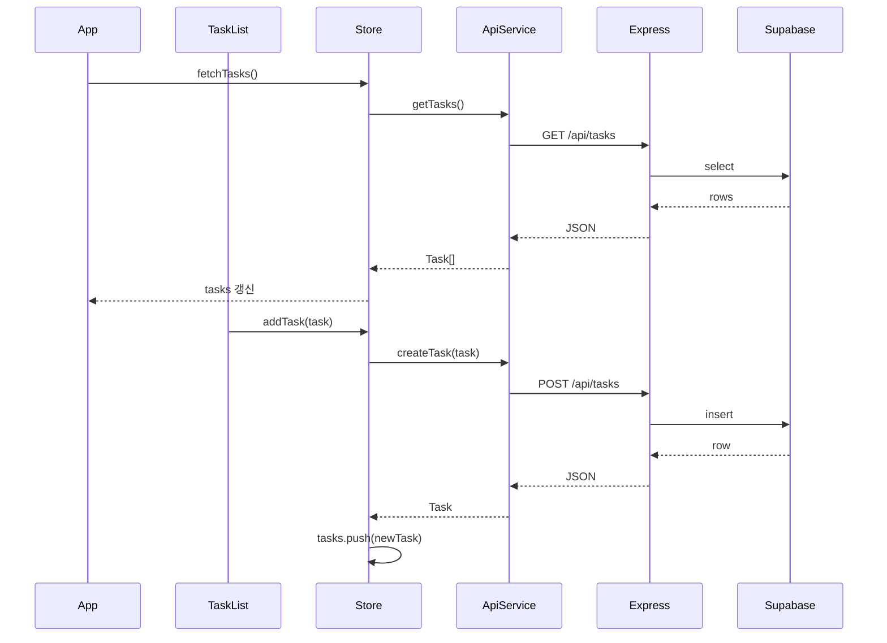

# 프론트엔드–백엔드 API 연동

## 현재 상태

- [src/services/api.ts](src/services/api.ts): `apiService`(getTasks, createTask, updateTask, deleteTask, toggleTaskComplete)가 이미 정의되어 `VITE_API_BASE_URL` 또는 `http://localhost:3001/api`로 요청함.
- [src/stores/task-store.ts](src/stores/task-store.ts): `apiService`를 사용하지 않고, 모든 메서드가 로컬 `tasks` ref만 갱신하는 동기 로직임.
- [App.vue](src/App.vue): 마운트 시 목록 로드 없음. `handleDelete`는 동기 호출만 함.
- [TaskList.vue](src/components/TaskList.vue): `addTask`, `updateTask`, `toggleTaskComplete`를 동기로 호출하고, 삭제는 `emit('delete')`로 부모에서 `deleteTask` 호출.

## 목표

모든 업무 데이터가 Express API → Supabase를 통해 저장·조회되도록 스토어와 앱/리스트를 수정.

## 수정 계획

### 1. Task Store를 API 기반으로 전환

**파일:** [src/stores/task-store.ts](src/stores/task-store.ts)

- `apiService` import 추가.
- 상태 추가: `isLoading`, `error` (ref).
- **fetchTasks()**: `apiService.getTasks()` 호출 후 `tasks.value`에 할당. try/catch에서 `error` 설정, finally에서 `isLoading` 해제. 실패 시 throw하여 호출부에서 처리 가능하도록 유지.
- **addTask(task)**:  
  - 시그니처를 `Omit<Task, 'id' | 'completed'>`로 변경 (API와 동일).  
  - `apiService.createTask(task)` 호출 후 반환된 Task를 `tasks.value`에 push.  
  - try/catch/finally로 `isLoading`, `error` 처리. 실패 시 throw.
- **updateTask(id, updates)**: `apiService.updateTask(id, updates)` 호출 후 반환된 Task로 배열 내 해당 항목 교체. 동일한 로딩/에러 처리.
- **toggleTaskComplete(id)**: `apiService.toggleTaskComplete(id)` 호출 후 반환된 Task로 배열 내 항목 교체. 동일한 로딩/에러 처리.
- **deleteTask(id)**: `apiService.deleteTask(id)` 호출 후 성공 시 배열에서 해당 id 제거. 동일한 로딩/에러 처리.
- 반환 객체에 `fetchTasks`, `isLoading`, `error` 추가.

### 2. App.vue: 초기 로드 및 삭제 비동기 처리

**파일:** [src/App.vue](src/App.vue)

- `onMounted`에서 `taskStore.fetchTasks()` 호출 (async/await, try/catch로 실패 시 콘솔 로그 등 처리).
- `handleDelete`를 async로 바꾸고, `await taskStore.deleteTask(taskId)` 후 `selectedTaskId` 정리. 실패 시 try/catch로 처리.

### 3. TaskList.vue: 스토어 비동기 호출 및 에러 처리

**파일:** [src/components/TaskList.vue](src/components/TaskList.vue)

- **handleAddSubmit**: async로 변경. `await taskStore.addTask(task)` 후 `showAddForm.value = false`. 실패 시 try/catch로 콘솔 또는 간단한 사용자 피드백.
- **handleEditSubmit**: async로 변경. `await taskStore.updateTask(...)` 후 `editingTaskId.value = undefined`. 실패 시 try/catch.
- **handleToggleComplete**: async로 변경. `await taskStore.toggleTaskComplete(taskId)`만 호출. 실패 시 try/catch.
- **handleDeleteClick**: 계속 `emit('delete', taskId)`만 수행 (부모에서 이미 `deleteTask`를 await 하므로 변경 없음).

추가로, 스토어의 `addTask` 시그니처가 `Omit<Task, 'id' | 'completed'>`로 바뀌므로, TaskForm에서 전달하는 payload가 이미 제목·설명·점수·날짜만 넘긴다면 타입만 맞추면 됨. 필요 시 TaskForm의 emit 타입을 `Omit<Task, 'id' | 'completed'>`로 명시.

### 4. (선택) 로딩/에러 UI

- 스토어의 `isLoading`/`error`를 App.vue 또는 TaskList에서 참조해, 로딩 중 스피너 또는 비활성화, 에러 시 메시지 표시할 수 있음.  
- 이번 작업 범위에서는 최소한으로 두고, 스토어에 상태만 추가한 뒤 필요 시 컴포넌트에서 사용하도록 둠.

## 데이터 흐름 (연동 후)

## 확인 사항

- 백엔드 서버가 `http://localhost:3001`에서 실행 중이어야 함.
- 루트 `.env`에 `VITE_API_BASE_URL=http://localhost:3001/api` 설정 시 해당 URL 사용 (미설정 시 코드 기본값 사용).