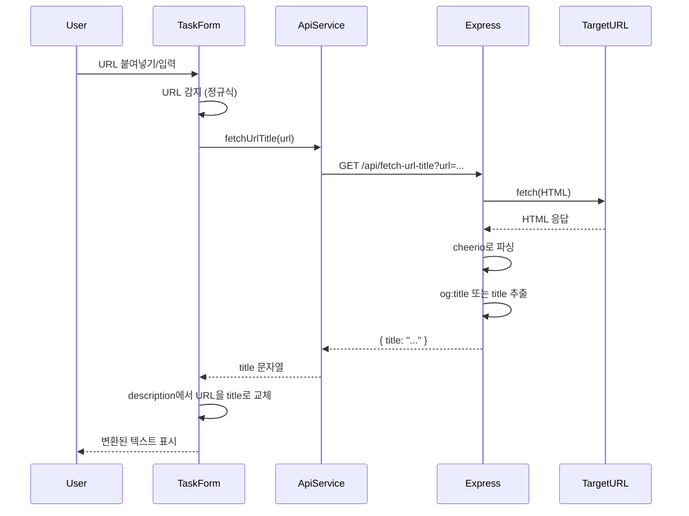

# URL 자동 제목 변환 기능 구현

## 목표

TaskForm의 textarea에서 URL을 입력하거나 붙여넣으면, Express 서버를 통해 해당 URL의 HTML을 가져와 `<title>` 태그를 추출하고, URL을 제목 텍스트로 자동 대체합니다.

## 구현 계획

### 1. Express 서버: URL 메타데이터 API 엔드포인트 추가

**파일:** [server/server.js](server/server.js)

- **의존성 추가**: `cheerio` 패키지 설치 필요 (HTML 파싱용)
- **새 엔드포인트**: `GET /api/fetch-url-title?url=<encoded_url>`
  - 쿼리 파라미터로 URL 받기
  - `fetch()`로 URL의 HTML 가져오기 (Node.js 18+ 내장 fetch 사용)
  - `cheerio`로 HTML 파싱
  - 우선순위: Open Graph `og:title` → `<title>` 태그 → URL 반환
  - 에러 처리: 네트워크 오류, 타임아웃(10초), 파싱 실패 시 원본 URL 반환
  - 응답 형식: `{ success: true, title: string, url: string }`

**파일:** [server/package.json](server/package.json)

- `cheerio` 의존성 추가

### 2. 프론트엔드 API 서비스: URL 제목 가져오기 함수 추가

**파일:** [src/services/api.ts](src/services/api.ts)

- `fetchUrlTitle(url: string): Promise<string>` 함수 추가
  - `GET /api/fetch-url-title?url=${encodeURIComponent(url)}` 호출
  - 응답에서 `title` 추출하여 반환
  - 에러 시 원본 URL 반환

### 3. TaskForm 컴포넌트: URL 감지 및 자동 변환

**파일:** [src/components/TaskForm.vue](src/components/TaskForm.vue)

- **URL 감지 함수**: `detectUrl(text: string): string | null`
  - 정규식으로 URL 패턴 감지: `https?://[^\s]+` 또는 더 정확한 URL 정규식
  - 감지된 첫 번째 URL 반환

- **제목 가져오기 함수**: `async fetchAndReplaceUrl(url: string)`
  - `apiService.fetchUrlTitle(url)` 호출
  - 현재 `formData.description`에서 해당 URL을 찾아 제목으로 교체
  - 로딩 상태 관리 (선택적, 간단한 플래그로 처리)

- **이벤트 핸들러**:
  - `@paste="handlePaste"`: 붙여넣기 시 클립보드 데이터에서 URL 감지
  - `@input="handleInput"`: 입력 시 debounce(500ms)로 URL 감지 (선택적, 과도한 API 호출 방지)
  - 또는 `@blur` 이벤트만 사용 (포커스 해제 시 한 번만 처리)

- **구현 세부사항**:
  - URL 감지 후 즉시 변환 (paste 이벤트 우선)
  - 이미 변환된 텍스트는 다시 변환하지 않도록 체크 (URL이 아닌 텍스트인지 확인)
  - 변환 중 로딩 표시 (선택적)

## 데이터 흐름



## 구현 세부사항

### URL 감지 정규식

```typescript
const URL_REGEX = /https?:\/\/[^\s]+/g
```

### 제목 추출 우선순위

1. Open Graph: `meta[property="og:title"]`
2. HTML Title: `<title>` 태그
3. 실패 시: 원본 URL 반환

### 에러 처리

- 네트워크 오류: 원본 URL 유지
- 타임아웃: 10초 제한
- CORS 오류: Express 서버가 프록시 역할로 해결
- 파싱 실패: 원본 URL 유지

## 확인 사항

- Node.js 버전이 18 이상이어야 내장 `fetch` 사용 가능 (또는 `node-fetch` 패키지 사용)
- cheerio 패키지 설치 필요: `npm install cheerio`
- Express 서버가 실행 중이어야 프론트엔드에서 API 호출 가능