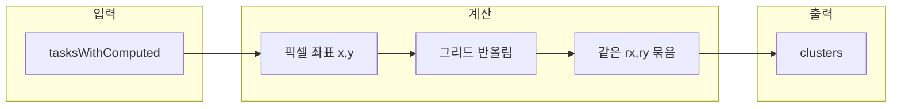

# 우선순위 매트릭스 클러스터 Fan-out 기능 설계

## 배경

- [PriorityMatrix.vue](src/components/PriorityMatrix.vue)에서 `priority-matrix__task-card`는 `position: absolute`로 동일 좌표에 겹쳐 쌓임.
- 위에 있는 카드만 포인터 이벤트를 받아, 아래 카드는 hover/선택 불가.

## 목표

- "같은 위치"를 **클러스터**로 정의.
- 클러스터에 **마우스 over** 시 해당 클러스터만 **fan-out** 레이아웃으로 잠깐 펼침.
- 펼친 상태에서 **z-index**를 올려 모든 카드가 보이고 선택 가능.

---

## 1. 클러스터 정의

- **같은 위치**: 카드 기준 위치 `(x, y)` (픽셀, `getTaskCardStyle`에서 계산한 값)를 일정 **그리드**(예: 20px)로 반올림한 `(rx, ry)`가 같으면 같은 클러스터.
- 그리드 크기: 20px 권장 (카드 크기·여백을 고려해 한 지점으로 묶이도록).
- 데이터: `tasksWithComputed`로부터 **클러스터 배열** `clusters`를 computed로 생성. 각 원소는 `{ centerX, centerY, tasks }` 형태. `getTaskCardStyle`과 동일한 `containerWidth/Height`, `paddingPx` 등을 사용해 픽셀 좌표를 계산한 뒤 그리드로 묶음.

---

## 2. Fan-out 레이아웃

- **트리거**: 클러스터에 속한 **임의의 카드**에 `mouseenter` 시, 해당 클러스터를 "펼침" 상태로 설정 (`hoveredClusterIndex`).
- **위치**: 클러스터 중심 `(centerX, centerY)`를 기준으로, 카드 N개를 **반지름 r**(예: 70px)의 원 위에 균등 배치.
  - 각 카드 각도: `θ_i = (2π * i) / N` (또는 아래쪽 반원: `π/2 + (π * i)/(N-1)` 등).
  - 카드 위치: `(centerX + r * cos(θ_i), centerY + r * sin(θ_i))`, 기존처럼 `transform: translate(-50%, -50%)` 유지.
- **z-index**: 펼친 클러스터의 모든 카드에 동일한 상대적으로 높은 z-index(예: 10) 부여해 다른 카드/클러스터보다 위에 그리기.
- **클러스터가 1개일 때**: fan-out 해도 한 장이므로 시각적 변화만 약간 두거나, 그대로 두어도 무방.

---

## 3. 펼침 해제 (collapse)

- **조건**: 마우스가 "클러스터의 fan-out 영역"을 벗어날 때 펼침 해제.
- **구현**: `hoveredClusterIndex !== null`일 때만, fan-out된 영역의 **bounding box** 크기로 **보조 div(백드롭)** 하나 렌더.
  - 위치/크기: fan-out 원의 바운딩 박스 (중심 ± (r + 카드 반폭/반높이)).
  - z-index: 카드보다 낮음(예: 8), 카드는 10.
  - 이 백드롭에 `mouseleave`를 걸어, 마우스가 이 영역을 벗어나면 `hoveredClusterIndex = null`로 초기화.
- 카드 간 이동 시에는 마우스가 여전히 백드롭 위에 있으므로 `mouseleave`가 발생하지 않고, 영역 밖으로 나갈 때만 접힘.

---

## 4. 수정 대상 파일 및 변경 요약

| 파일                                                                   | 변경 내용                                                                          |
| ---------------------------------------------------------------------- | ---------------------------------------------------------------------------------- |
| [src/components/PriorityMatrix.vue](src/components/PriorityMatrix.vue) | 클러스터 계산, hoveredClusterIndex 상태, getTaskCardStyle 확장, 백드롭 div, 스타일 |

### 4.1 스크립트

- **상태**: `hoveredClusterIndex = ref<number | null>(null)` 추가.
- **Computed**: `clusters` — `tasksWithComputed`와 동일한 위치 계산 로직으로 각 task의 (x, y)를 구한 뒤 20px 그리드로 반올림해 같은 (rx, ry)끼리 묶고, 각 클러스터의 `centerX`, `centerY`(픽셀) 및 `tasks` 배열 반환.
- **getTaskCardStyle(task)**
  - task가 속한 클러스터 인덱스와 해당 클러스터가 현재 hovered인지 판별.
  - **hovered 클러스터일 때**: fan-out 위치 `(centerX + r*cos(θ_i), centerY + r*sin(θ_i))` 및 `zIndex: 10` 반환.
  - **그 외**: 기존처럼 개별 (x, y) 및 기존 z-index(또는 1).
- **이벤트**:
  - 각 카드 `@mouseenter`: 해당 task가 속한 클러스터 인덱스를 `hoveredClusterIndex`에 설정.
  - 백드롭 `@mouseleave`: `hoveredClusterIndex = null`.
- **task → 클러스터 매핑**: `clusters`를 만들 때 `taskId → { clusterIndex, indexInCluster }` 맵을 함께 두면 스타일/이벤트에서 사용하기 쉬움.

### 4.2 템플릿

- 기존: `v-for="task in tasksWithComputed"` 로 카드 렌더링.
- 변경:
  - `hoveredClusterIndex !== null`일 때 **백드롭 div** 1개 추가 (bounding box 위치/크기, `@mouseleave`).
  - 카드는 기존처럼 `v-for="task in tasksWithComputed"` 유지하되, `getTaskCardStyle(task)`가 클러스터·hover 상태에 따라 fan-out 좌표 또는 기본 좌표를 주도록 함.

### 4.3 스타일

- 카드에 인라인으로 `z-index` 적용 (이미 `getTaskCardStyle`에서 반환).
- hover 시 `transform`이 fan-out 위치와 함께 적용되므로, 기존 `&:hover { transform: ... scale(1.05) }`는 fan-out 좌표와 충돌하지 않도록 유지하거나, fan-out 시에는 scale만 추가하는 식으로 정리.

---

## 5. 유의사항

- **컨테이너 크기 0**: `containerWidth/Height === 0`일 때는 현재처럼 % 기반 위치만 쓰므로, 클러스터는 픽셀 기반 계산이 가능해질 때(크기 갱신 후) 적용. 그 전에는 클러스터를 빌드하지 않거나, 모든 task를 1 task 1 클러스터로 두어 동작만 유지.
- **접근성**: 키보드로 클러스터 진입/카드 선택이 필요하면 이후에 `focus`/`focuswithin` 기반으로 같은 로직 확장 가능.
- **애니메이션**: fan-out/접힘 시 `transition`을 두면 UX 개선 가능 (선택 사항).
