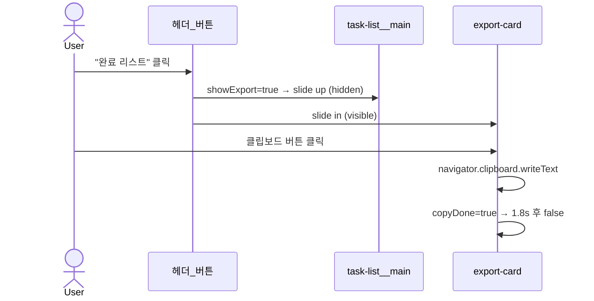

# 완료 항목 텍스트 내보내기 플랜

## 변경 파일

**수정: `[src/components/TaskList.vue](src/components/TaskList.vue)`**

---

## 1. 스크립트 추가

```typescript
// 완료 리스트 뷰 토글
const showExport = ref(false);
const copyDone = ref(false);

const exportText = computed(() =>
  displayCompletedTasks.value.map((t, i) => `${i + 1}. ${t.title}`).join("\n"),
);

async function copyExportText() {
  await navigator.clipboard.writeText(exportText.value);
  copyDone.value = true;
  setTimeout(() => (copyDone.value = false), 1800);
}
```

---

## 2. 템플릿 변경

### 헤더에 토글 버튼 추가 (추가 버튼 옆)

```html
<button
  class="task-list__export-btn"
  :class="{ 'task-list__export-btn--active': showExport }"
  @click="showExport = !showExport"
>
  완료 리스트
</button>
```

### 슬라이드 래퍼 구조

기존 콘텐츠(skeleton + empty + section들)를 `.task-list__main` div로 감싸고, export 카드와 함께 토글 처리:

```html
<!-- 기존 목록 (slide up when showExport) -->
<div class="task-list__main" :class="{ 'task-list__main--hidden': showExport }">
  <!-- 기존 skeleton, empty, 미완료/완료 섹션 그대로 -->
</div>

<!-- 완료 텍스트 카드 (slide in when showExport) -->
<div
  class="task-list__export-card"
  :class="{ 'task-list__export-card--hidden': !showExport }"
>
  <div class="task-list__export-header">
    <span class="task-list__export-title">
      완료 목록 ({{ displayCompletedTasks.length }}건)
    </span>
    <button
      class="task-list__export-copy"
      :class="{ 'task-list__export-copy--done': copyDone }"
      :disabled="displayCompletedTasks.length === 0"
      @click="copyExportText"
    >
      <!-- 클립보드 아이콘 or "복사됨" -->
    </button>
  </div>
  <ol v-if="displayCompletedTasks.length > 0" class="task-list__export-list">
    <li v-for="t in displayCompletedTasks" :key="t.id">{{ t.title }}</li>
  </ol>
  <p v-else class="task-list__export-empty">완료된 업무가 없습니다.</p>
</div>
```

---

## 3. SCSS — 슬라이드 애니메이션

```scss
// 기존 목록 slide up
.task-list__main {
  transition:
    transform 0.3s ease,
    opacity 0.3s ease,
    max-height 0.35s ease;
  max-height: 9999px;

  &--hidden {
    transform: translateY(-20px);
    opacity: 0;
    pointer-events: none;
    max-height: 0;
    overflow: hidden;
  }
}

// 텍스트 카드 slide in
.task-list__export-card {
  transition:
    transform 0.3s ease,
    opacity 0.3s ease,
    max-height 0.35s ease;
  max-height: 9999px;
  border: 1px solid $color-gray-200;
  border-radius: $radius-lg;
  background: $color-white;
  padding: $spacing-md;

  &--hidden {
    transform: translateY(20px);
    opacity: 0;
    pointer-events: none;
    max-height: 0;
    overflow: hidden;
  }
}

.task-list__export-header {
  display: flex;
  align-items: center;
  justify-content: space-between;
  margin-bottom: $spacing-sm;
}

.task-list__export-title {
  font-size: 0.875rem;
  font-weight: 600;
  color: $color-gray-800;
}

.task-list__export-copy {
  // 클립보드 아이콘 버튼, done 시 체크 아이콘으로 전환
  &--done {
    color: $color-success;
  }
}

.task-list__export-list {
  margin: 0;
  padding-left: 1.25rem;
  font-size: 0.875rem;
  line-height: 1.7;
  color: $color-gray-700;
}
```

---

## 동작 흐름


