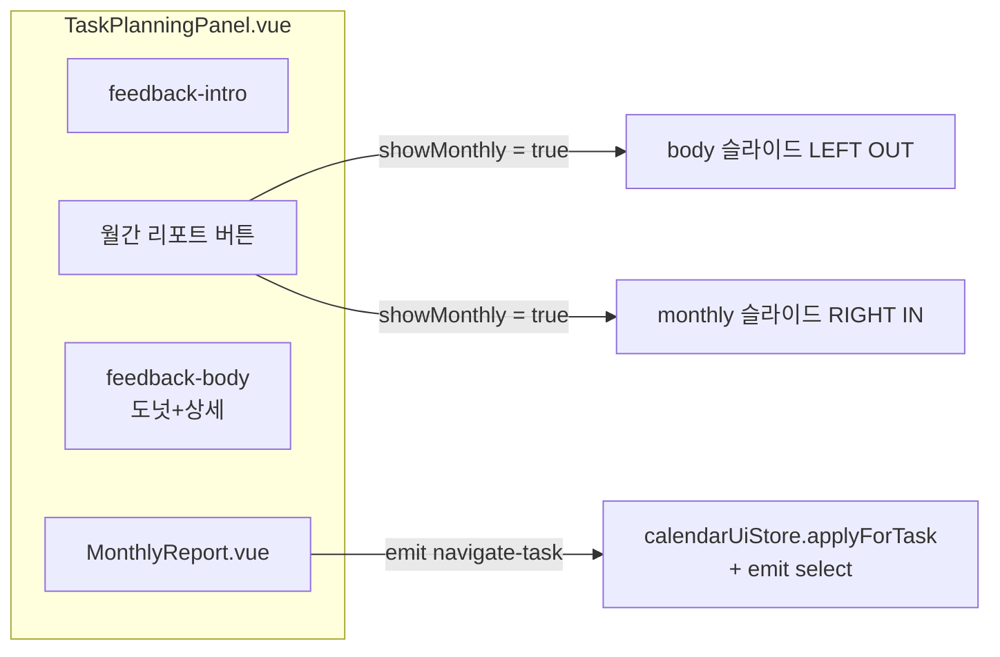
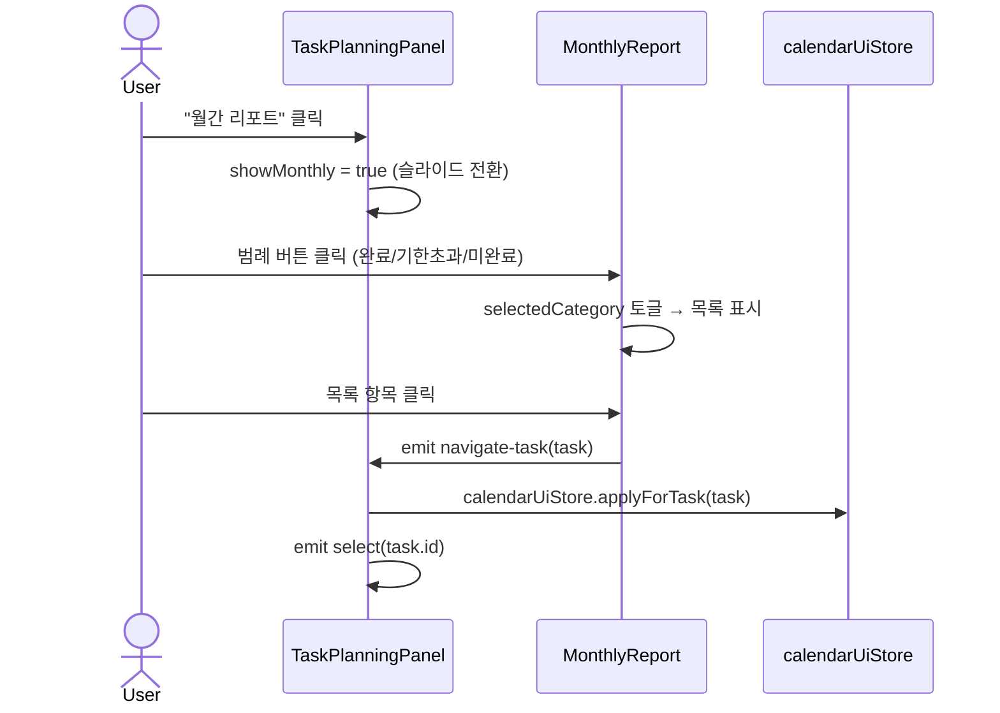

# 월간 리포트 기능 구현 플랜

## 구현 범위



---

## 1. 새 유틸: `src/utils/task-monthly.ts`

월의 기준 태스크: **deadline이 해당 월**에 속하는 태스크. deadline 없으면 startDate → createdAt 순으로 fallback.

```typescript
interface DailyStatPoint {
  dateKey: string;
  day: number;
  completed: number;
  overdue: number;
  incomplete: number;
}

interface MonthlyReportResult {
  dailyStats: DailyStatPoint[]; // 월 내 일별 집계 (라인차트용)
  completedTasks: Task[];
  overdueTasks: Task[]; // !completed && deadline < todayKey
  incompleteTasks: Task[]; // !completed && deadline >= todayKey
  problemRate: number; // (overdue + incomplete) / total
}

function computeMonthlyReport(
  tasks,
  year,
  month,
  todayKey?,
): MonthlyReportResult;
```

---

## 2. 새 컴포넌트: `src/components/MonthlyReport.vue`

### 내부 상태

- `reportYear`, `reportMonth` — 초기값: 현재 월, 내부 prev/next 네비게이션
- `selectedCategory: 'completed' | 'overdue' | 'incomplete' | null`
- `monthlyResult` — `computeMonthlyReport` 결과 (computed)

### 템플릿 구성

```
MonthlyReport
  ├─ 월 네비 헤더 (← N년 M월 →)
  ├─ SVG 라인차트
  │    ├─ X축: 일(1~말일)
  │    ├─ Y축: 건수
  │    └─ 3개 polyline: 완료(#22c55e) / 기한초과(#ef4444) / 미완료(#f59e0b)
  ├─ 피드백 코멘트
  │    ├─ problemRate > 0.5 → "개선 필요" 메시지
  │    └─ ≤ 0.5 → 칭찬 릴레이 메시지
  ├─ 범례 버튼 (FeedbackDonut legend-btn 스타일 동일하게)
  │    ├─ 완료 N건
  │    ├─ 기한초과 N건
  │    └─ 미완료 N건
  └─ 태스크 목록 (selectedCategory 에 따라 표시)
       └─ 항목 클릭 → emit('navigate-task', task)
```

### Props / Emits

- `props`: `tasks: Task[]`
- `emits`: `navigate-task(task: Task)`

---

## 3. `TaskPlanningPanel.vue` 수정

### 스크립트 추가

```typescript
const showMonthly = ref(false);

function onMonthlyTaskNavigate(task: Task) {
  calendarUiStore.applyForTask(task);
  emit("select", task.id);
}
```

### 템플릿 구조 변경

```html
<!-- 기존 feedback-intro 아래 -->
<button class="task-planning__monthly-btn" @click="showMonthly = !showMonthly">
  {{ showMonthly ? '← 돌아가기' : '월간 리포트' }}
</button>

<!-- 슬라이드 래퍼 -->
<div class="task-planning__panel-wrap">
  <!-- 기존 도넛+상세: slide-left when showMonthly -->
  <div
    class="task-planning__feedback-body"
    :class="{ 'task-planning__feedback-body--hidden': showMonthly }"
  >
    <!-- 기존 donuts + feedback-detail 그대로 -->
  </div>

  <!-- 월간 리포트: slide-right when !showMonthly -->
  <MonthlyReport
    class="task-planning__monthly-wrap"
    :class="{ 'task-planning__monthly-wrap--hidden': !showMonthly }"
    :tasks="taskStore.tasks"
    @navigate-task="onMonthlyTaskNavigate"
  />
</div>
```

### SCSS 슬라이드 애니메이션

```scss
.task-planning__panel-wrap {
  overflow: hidden;
  position: relative;
}

.task-planning__feedback-body {
  transition:
    transform 0.3s ease,
    opacity 0.3s ease,
    max-height 0.3s ease;
  &--hidden {
    transform: translateX(-24px);
    opacity: 0;
    pointer-events: none;
    max-height: 0;
    overflow: hidden;
  }
}

.task-planning__monthly-wrap {
  transition:
    transform 0.3s ease,
    opacity 0.3s ease,
    max-height 0.3s ease;
  &--hidden {
    transform: translateX(24px);
    opacity: 0;
    pointer-events: none;
    max-height: 0;
    overflow: hidden;
  }
}
```

---

## 수정 파일 목록

- **신규** `[src/utils/task-monthly.ts](src/utils/task-monthly.ts)` — 월간 집계 유틸
- **신규** `[src/components/MonthlyReport.vue](src/components/MonthlyReport.vue)` — 라인차트 + 범례 + 목록
- **수정** `[src/components/TaskPlanningPanel.vue](src/components/TaskPlanningPanel.vue)` — 버튼 추가, 슬라이드 래퍼, MonthlyReport 연결

---

## 동작 흐름


