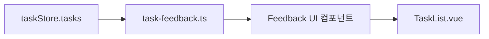

# 일간·주간 업무 피드백 (경고 + 칭찬 릴레이)

## 배경과 제약

- `[src/types/task.ts](src/types/task.ts)`: `completed`, `startDate`, `deadline`, `createdAt`, `updatedAt`만 있고 **완료 시각(`completedAt`)은 없음**. 따라서 “마감 전에 완료했다”는 정확한 판정은 불가하고, **미완료 + 마감 경과**는 `[date-formatter`의 `isOverdue](src/utils/date-formatter.ts)` 등으로 명확히 할 수 있음.
- “해당 일정에 완료 못함”은 제품적으로 아래처럼 **명시적 규칙**을 정한 뒤 구현하는 것이 안전함 (아래는 권장 MVP 정의).

## 권장 비즈니스 규칙 (MVP)

**공통 전제**: 피드백 대상은 **미완료(`!completed`)** 업무만. (완료된 항목은 “미달” 목록에 넣지 않음.)

**일간 (선택일 = `selectedCalendarDay` 또는 오늘)**

| 유형                    | 조건 (권장)                                                                                |
| ----------------------- | ------------------------------------------------------------------------------------------ |
| 그날 마감인데 미완료    | `deadline`의 로컬 날짜 키가 **선택일**과 같고 미완료                                       |
| (선택) 기한 초과 미완료 | `deadline`이 **선택일 23:59 이전**으로 이미 지났고 미완료 (`isOverdue`) — “밀린 일”로 표시 |

**일간 칭찬**: 위 “그날 마감 미완료” 목록이 **비어 있고**, (선택적으로) “선택일에 활성인 미완료 업무가 없거나 모두 완료” 같은 조건을 만족할 때 격려 문구. 단순화하려면 **“그날 마감 예정인 미완료가 0건이면 칭찬”**만 써도 됨.

**주간 (금주 월~일, 기존 `getWeekDaysMonSun` / `weekAnchor`와 동일)**

| 유형                           | 조건 (권장)                                                                        |
| ------------------------------ | ---------------------------------------------------------------------------------- |
| 주 안에 마감이 있었는데 미완료 | `deadline` 로컬 날짜가 **해당 주 7일 중 하루**에 속하고 미완료                     |
| 주간 밀림                      | 마감이 **주 시작 전**인데 아직 미완료 (또는 `isOverdue`인 항목을 주간 요약에 포함) |

**주간 칭찬**: “이번 주에 마감이었던 미완료 업무가 0건” (또는 주간 뷰에서 추적하는 범위 내 미완료 0)일 때 격려.

**일정만 있고 마감 없음**: `deadline`이 없으면 “마감 못 지킴” 판정이 애매함 → MVP에서는 **deadline 기반만** 피드백에 쓰거나, `getTaskSpanDateKeys`의 **마지막 날**을 가짜 마감처럼 쓰는지 제품에서 한 번 더 확정하는 것이 좋음.

## 아키텍처

1. **순수 함수 모듈** (예: `[src/utils/task-feedback.ts](src/utils/task-feedback.ts)` 신규)

- 입력: `Task[]`, 일간 기준 `dateKey: string`, 주간 기준 `weekStartKey` + `weekEndKey` (또는 `WeekDayCell[]`에서 유도).
- 출력: `{ missedDeadlineTasks, overdueIncomplete, dailyPraise, weeklyPraise, ... }` 같은 **구조화된 결과** + 표시용 문자열/카운트는 컴포넌트 또는 i18n 맵에서 조합.

1. **UI**: `TaskFeedbackPanel` 또는 `TaskList__feedback` — `[TaskList.vue](src/components/TaskList.vue)`에서 **주간 스트립 위 또는 “업무 목록” 헤더 바로 위**에 배치 (이미 캘린더 슬라이드가 있으므로 **주간 툴바 아래 / 캘린더 위**가 시야에 잘 들어옴).
2. **토글**: “일간”은 **현재 선택된 캘린더 날짜**와 동기화. “주간”은 **현재 `weekAnchor` 주**와 동기화. 탭 또는 접이식 두 블록 중 하나 선택.

## 카피 (예시)

- 경고: `마감일이 [날짜]인 업무 N건이 아직 완료되지 않았어요.` / `이번 주 마감인 미완료 업무가 N건 있어요.`
- 칭찬: `오늘 마감인 업무를 모두 처리했어요. 잘 지키고 있어요!` / `이번 주 마감 일정을 모두 맞췄어요. 훌륭해요!`
- “릴레이”: 같은 격려 문구를 **여러 문장 풀**에서 `dateKey` 또는 주차 해시로 **하나 고르기** (진짜 연속 일수 추적은 로컬 스토리지에 `lastPraiseDate` 저장 시 확장 가능).

## 테스트

- `[src/tests/utils/task-feedback.test.ts](src/tests/utils/task-feedback.test.ts)`: 마감일·주간 범위 고정된 `Task` 픽스처로 **미완료 집계·빈 배열 시 칭찬 조건** 단위 테스트.

## 후속 (범위 밖으로 두기 좋음)

- DB/API에 `**completed_at` 추가 후 “제시간 완료” 칭찱 정확도 향상.
- 푸시/이메일 알림, 하루 한 번 요약.

## 구현 시 건드릴 파일 (요약)

| 파일                                                         | 역할                                                  |
| ------------------------------------------------------------ | ----------------------------------------------------- |
| `src/utils/task-feedback.ts`                                 | 일간/주간 집계 순수 함수                              |
| `src/components/TaskFeedback*.vue` (또는 TaskList 내부 섹션) | 메시지 + 스타일                                       |
| `[src/components/TaskList.vue](src/components/TaskList.vue)` | `selectedCalendarDay`, `weekCells`와 연동해 util 호출 |
| `src/tests/utils/task-feedback.test.ts`                      | 단위 테스트                                           |
