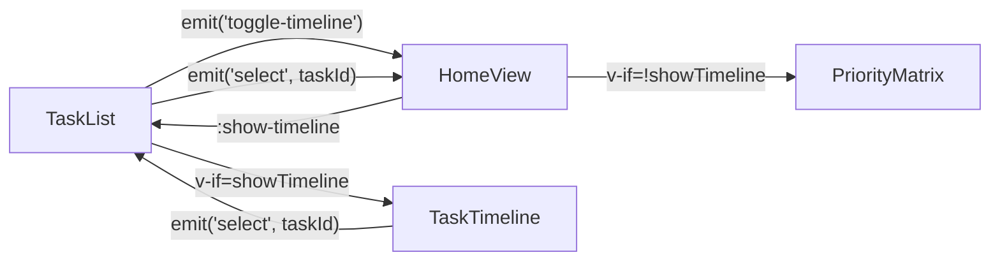
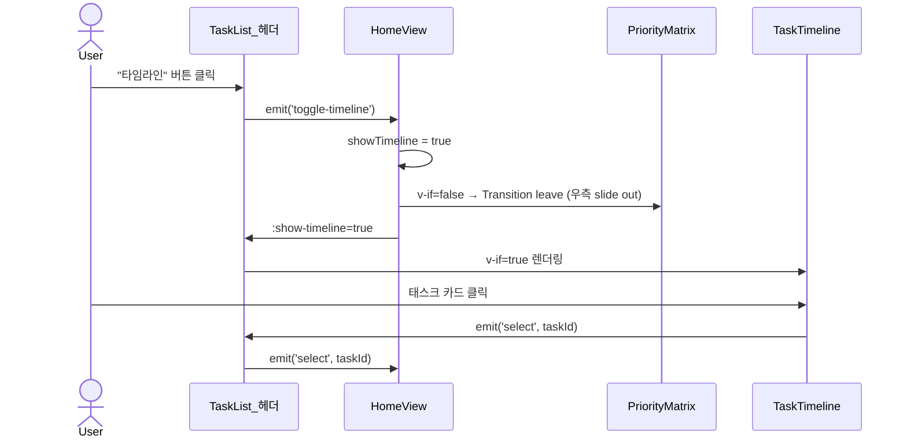

# 타임라인 뷰 구현 플랜

## 변경 파일

- 신규: `[src/components/TaskTimeline.vue](src/components/TaskTimeline.vue)`
- 수정: `[src/components/TaskList.vue](src/components/TaskList.vue)`
- 수정: `[src/views/HomeView.vue](src/views/HomeView.vue)`

---

## 데이터 흐름



---

## 1. TaskTimeline.vue (신규)

### Props / Emits

```typescript
interface Props {
  selectedTaskId?: string;
}
interface Emits {
  (e: "select", taskId: string): void;
}
```

### 날짜 그루핑 로직

```typescript
// 대표 날짜: startDate > deadline > createdAt 우선순위
function getPrimaryDateKey(task: Task): string | null {
  return (
    task.startDate?.slice(0, 10) ??
    task.deadline?.slice(0, 10) ??
    task.createdAt?.slice(0, 10) ??
    null
  );
}

interface TimelineColumn {
  dateKey: string; // 'YYYY-MM-DD' | 'no-date'
  label: string; // '4월 3일 (금)'
  tasks: Task[];
}

const columns = computed<TimelineColumn[]>(() => {
  // 1) taskStore.tasks 전체 대상
  // 2) dateKey 로 Map 그루핑
  // 3) 날짜 오름차순 정렬, null → 'no-date' 컬럼으로 맨 끝에 추가
});
```

### 레이아웃

- 컨테이너: `display: flex; overflow-x: auto; gap: $spacing-md; padding-bottom: $spacing-md`
- 컬럼: `min-width: 190px; flex-shrink: 0`
- 컬럼 헤더: 날짜 레이블 + 업무 건수 배지
- 태스크 카드: 상태별 좌측 컬러 바 (primary/danger/success), 제목, 시간(HH:mm), 기한초과 배지
- 선택 시 `--selected` 클래스 (primary border)

---

## 2. TaskList.vue 수정

### 헤더 버튼 추가

```html
<!-- 완료 리스트 복사 버튼 옆에 추가 -->
<button
  type="button"
  class="task-list__timeline-btn"
  :class="{ 'task-list__timeline-btn--active': showTimeline }"
  @click="toggleTimeline"
>
  타임라인
</button>
```

### 스크립트

```typescript
const props = defineProps<{ selectedTaskId?: string; showTimeline: boolean }>();
const emit = defineEmits<{
  (e: "select", taskId: string): void;
  (e: "delete", taskId: string): void;
  (e: "toggle-timeline"): void; // 추가
}>();

function toggleTimeline() {
  emit("toggle-timeline");
}
```

### 콘텐츠 전환

```html
<!-- 기존 main-outer / export-outer 영역을 v-if로 감싸기 -->
<template v-if="!showTimeline">
  <!-- 기존 task-list__main-outer, export-outer 전부 -->
</template>
<TaskTimeline
  v-else
  :selected-task-id="selectedTaskId"
  @select="emit('select', $event)"
/>
```

---

## 3. HomeView.vue 수정

### 스크립트

```typescript
const showTimeline = ref(false);

function handleToggleTimeline() {
  showTimeline.value = !showTimeline.value;
}
```

### 템플릿

```html
<!-- tasks col에 prop + emit 추가 -->
<TaskList
  :selected-task-id="selectedTaskId"
  :show-timeline="showTimeline"
  @select="handleSelect"
  @delete="handleDelete"
  @toggle-timeline="handleToggleTimeline"
/>

<!-- matrix: Transition + v-if -->
<Transition name="matrix-exit">
  <section v-if="!showTimeline" class="app__col app__col--matrix">
    <PriorityMatrix ... />
  </section>
</Transition>
```

### SCSS

```scss
// matrix slide-out (우측으로 퇴장)
.matrix-exit-leave-active {
  position: absolute;
  right: $spacing-xl;
  top: $spacing-xl;
  bottom: $spacing-xl;
  width: minmax(0, 2.4fr); // 시각적 너비 유지
  transition:
    transform 0.35s cubic-bezier(0.4, 0, 0.2, 1),
    opacity 0.28s;
  pointer-events: none;
}
.matrix-exit-leave-to {
  transform: translateX(calc(100% + #{$spacing-xl}));
  opacity: 0;
}
// matrix 복귀 (우측에서 진입)
.matrix-exit-enter-active {
  transition:
    transform 0.35s cubic-bezier(0.4, 0, 0.2, 1),
    opacity 0.28s;
}
.matrix-exit-enter-from {
  transform: translateX(60px);
  opacity: 0;
}

// timeline 모드: tasks col이 남은 너비 전부 차지
.app__main--timeline {
  grid-template-columns: minmax(200px, 1fr) 1fr;
}
```

`app__main` 에 `:class="{ 'app__main--timeline': showTimeline }"` 바인딩.

---

## 동작 흐름


